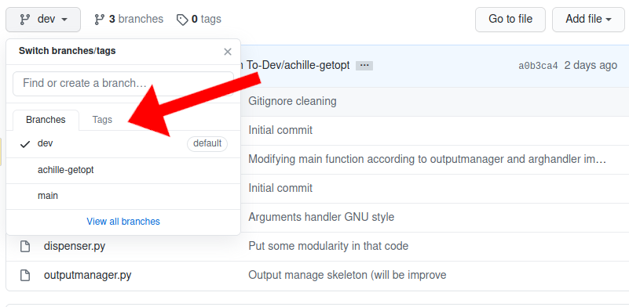
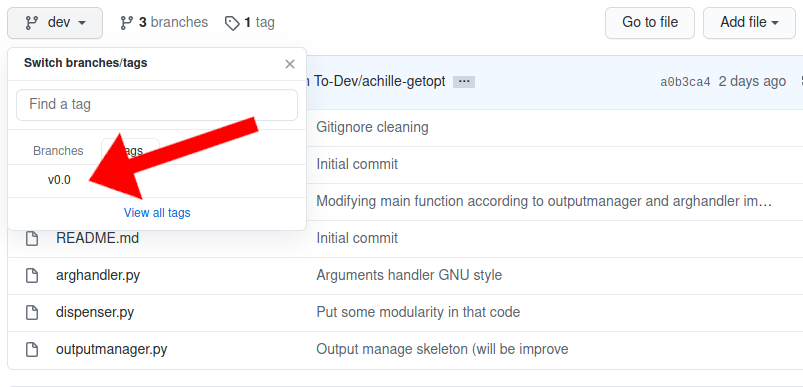
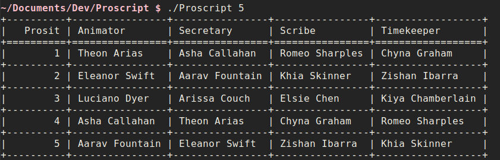
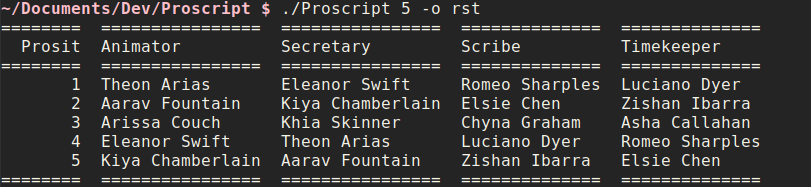

# Proscript

Role dispenser script for CESI's PBL Prosit. This script dispense prosit roles equally beetween each member of the group. The fact that this is a dull and repetitive task is exactly why this script has been created.

## Requirements

You need to have python3 install on your machine to run that python script. If you don't have it go get it [here](https://www.python.org/downloads/ "Python download link") or via command line if your have package manager. For example on Ubuntu based distro :

``` bash
sudo apt install python3
```

You also need a pip lib named **tabulate** on GNU/linux distros or Windows Operating Systems you have to run this command:

``` bash
pip3 install tabulate
```

## Installation

First you need to switch the version of this program on the release tag you want to install. Click on tags and then on the release one you want.





Next you need to clone this repo or download the zip on the green button. If you choose the zip extract it. Once you have the folder on your computer enter in to it and run the Proscript python script.

## Usage

This script need an entry list named "Team" by default following this pattern:

``` text
Theon Arias
Chyna Graham
Romeo Sharples
Arissa Couch
Kiya Chamberlain
Aarav Fountain
Khia Skinner
Asha Callahan
Luciano Dyer
Eleanor Swift
Zishan Ibarra
Elsie Chen
```

This file is already in the repository so you can directly edit it and put names of your group. Thats it you can now use the command, a basic example will be:



On Windows on a custom entry list because of the extensions it will be:

``` powershell
py Proscript 5 -l Team.txt
```
If you are on Windows you need to replace the "./" by "py " for every commands in this document.

### -l --list

This is the way to specify an custom entry list like on the previously viewed Windows command.

``` bash
./Proscript 5 --list=CustomList
```
OR
``` bash
./Proscript 5 -l CustomList
```

### -o --output

This tag is used to change the output format of the command. Behind the scene this is the pip package tabulate which handle this option so check for all possibility on the [documentation](https://github.com/astanin/python-tabulate#table-format "Documentation of the tabulate pip package in the Table format section")

``` bash
./Proscript 5 --output=rst
```
OR
``` bash
./Proscript 5 -o rst
```
The *rst* output format will look like this:



You can do pretty awesome things with an option like the following one:

``` bash
./Proscript 5 -o html > prosits.html
```
On Windows it is with something like that:
``` powershell
py Proscript 5 -l Team.txt | out-file -filepath prosits.html
```

If you redirect the output to a file with the html option you have now a file that is easily readable by a mail client. So you can use your mail sender, import and send it to your team.

### -h --help

This param simply display a help message in the console with a brief summary of the options availables.
